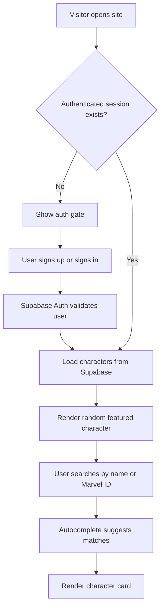
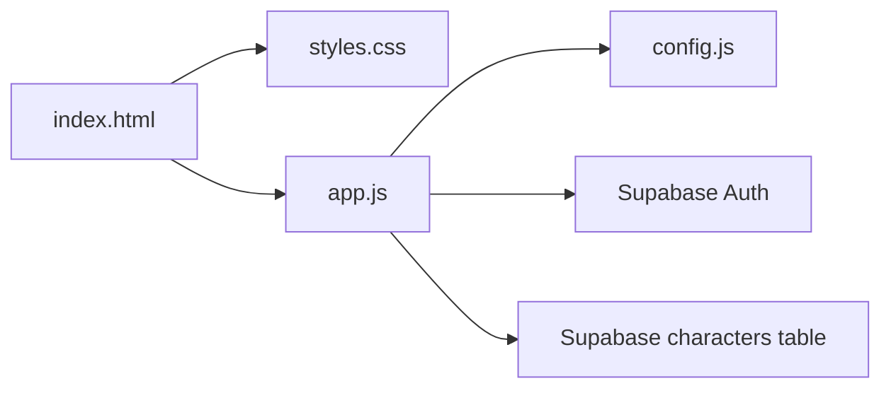

# Marvel Character Vault

<div align="center">

## A cinematic Marvel character browser powered by Supabase

Static frontend, animated search experience, character detail cards, and email authentication in one lightweight project.


</div>

---

## Project Snapshot

This project is a Marvel-themed single-page application built to search and display character records from a Supabase database. It started as a clean static site and evolved into a more polished product with:

- animated search and autocomplete
- dynamic character cards
- image fallback handling
- Supabase-powered live data
- sign up and sign in with email/password
- session-aware private access UI

The app keeps the stack intentionally small: no framework, no build system, and no heavy client architecture. Everything runs from plain HTML, CSS, and JavaScript.

---

## Preview

### Main Experience

- Marvel-branded hero section
- search input with autocomplete list
- detail card with image, description, metadata, and download action
- animated background particles and branded color system

### Auth Experience

- full-screen authentication gate
- `Sign In` and `Sign Up` toggle
- Supabase session restore on refresh
- account panel with signed-in email and sign-out action

---

## Visual Flow



---

## Tech Stack

| Layer | Tool | Purpose |
|---|---|---|
| Frontend | `HTML5` | Page structure and semantic layout |
| Styling | `CSS3` | Marvel-inspired visuals, responsive layout, animations |
| Logic | `Vanilla JavaScript` | Search, filtering, rendering, auth flow |
| Backend | `Supabase` | Authentication and character data |
| Hosting | Any static host | Can run locally or deploy as a static site |

---

## Folder Structure

```text
MARVEL/
├── index.html
├── styles.css
├── app.js
├── config.js
├── package.json
└── Demo/
    └── Screenshot 2026-04-20 160655.png
```

---

## How I Created This Project

This is the detailed build story for the project from start to finish.

### 1. Planned the UI direction

I wanted the app to feel more like a themed product than a plain data table, so I chose:

- a Marvel-inspired red, gold, and deep-blue palette
- strong display typography
- a centered single-column layout for mobile and desktop clarity
- animated particles and glow effects to keep the page visually active

The goal was to make a simple static page feel cinematic without adding a frontend framework.

### 2. Built the static layout in `index.html`

The first version of the page focused on the main browsing experience:

- page header
- search input
- autocomplete container
- result display container
- footer

Later, I expanded the same page to include an authentication shell that appears before the user can access the app.

### 3. Designed the full visual system in `styles.css`

The styling phase was not just about colors. I created a reusable visual system:

- root CSS variables for brand colors
- gradients for depth
- particle animation for the background
- interactive hover states
- mobile-responsive card and input layouts
- loading shimmer state
- hidden utility state

After auth was added, I extended the styles with:

- a blurred locked-state background
- auth card layout
- auth tabs for `Sign In` and `Sign Up`
- success and error message styling
- account panel for authenticated users

### 4. Connected frontend logic in `app.js`

The JavaScript layer powers the app behavior:

- reading config from `config.js`
- loading character records
- normalizing Supabase rows for UI rendering
- building autocomplete suggestions
- matching by character name or Marvel ID
- rendering a character card dynamically
- creating inline SVG fallback images when a character image fails

This kept the page dynamic while still remaining fully framework-free.

### 5. Wired Supabase data

The project uses Supabase as the source of truth for Marvel characters.

I connected the frontend using:

- `supabaseUrl`
- `supabaseAnonKey`
- the `characters` table

When live data is available, the app queries Supabase directly from the browser. If something fails, the app can fall back to demo records so the UI still has meaningful content.

### 6. Added authentication and authorization

The next step was turning the public demo into a protected app.

I integrated `@supabase/supabase-js` authentication so that:

- users must sign up or sign in with email/password
- the app checks for an active session on load
- unauthenticated visitors stay behind the auth gate
- authenticated users can enter the app and browse records
- users can sign out from the header panel

This made the experience feel more like a real product instead of an open demo page.

### 7. Prepared Supabase-side security requirements

Frontend auth alone is not enough, so the project also needs Supabase-side protection:

- enable the Email auth provider
- configure SMTP if email confirmation is enabled
- add the correct site URL and redirect URLs
- enable Row Level Security on the `characters` table
- create a `SELECT` policy for authenticated users only

That closes the gap between a protected interface and a protected database.

### 8. Kept the project lightweight

One of the main engineering decisions was to avoid unnecessary complexity.

I intentionally kept:

- no React
- no bundler
- no database proxy layer
- no custom backend server

That makes the project easy to understand, easy to host, and easy to demo in a classroom or portfolio setting.

---

## Architecture



---

## Core Features

### Search and Discovery

- search by character name
- search by Marvel ID
- grouped autocomplete suggestions
- highlighted text match in dropdown

### Character Display

- polished detail card
- creation and update dates
- image availability status
- download button for character image
- inline fallback graphic if an image fails

### Authentication

- sign up with email and password
- sign in with email and password
- automatic session restore
- sign out action
- gated UI for unauthenticated users

### UX and Styling

- branded animated interface
- shimmer loading state
- responsive layout
- visual focus states
- feedback banners for success and failure conditions

---

## Local Development

Run the site locally:

```bash
npm run dev
```

Default URL:

```text
http://127.0.0.1:8000
```

If port `8000` is busy:

```bash
PORT=8080 npm run dev
```

---

## Supabase Configuration

The app expects `config.js` to contain:

```js
window.MARVEL_CONFIG = {
  supabaseUrl: "YOUR_SUPABASE_URL",
  supabaseAnonKey: "YOUR_SUPABASE_ANON_KEY",
  table: "characters",
  imageFallback: "YOUR_FALLBACK_IMAGE_URL",
};
```

### Required Auth Setup

In Supabase:

1. Enable `Authentication -> Providers -> Email`
2. Set `Authentication -> URL Configuration`
3. Add your local and production redirect URLs
4. Configure SMTP if confirmation emails are enabled

### Recommended Database Security

```sql
alter table public.characters enable row level security;

create policy "authenticated users can read characters"
on public.characters
for select
to authenticated
using (true);
```

---

## Expected Database Columns

The UI is currently mapped to `public.characters` with these fields:

- `id`
- `marvel_id`
- `name`
- `description`
- `thumbnail_url`
- `image_available`
- `created_at`
- `updated_at`

If the table schema changes, update the normalization logic in `app.js`.

---

## Why This Project Matters

This project demonstrates practical frontend engineering with real backend integration:

- strong UI styling without a framework
- clean vanilla JavaScript state handling
- real Supabase database usage
- real authentication flow
- deployment-friendly static architecture

It is a good example of building a visually strong product with a minimal stack.

---

## Future Improvements

- password reset flow
- email verification success screen
- protected admin-only insert/update actions
- pagination or lazy loading for large datasets
- favorites or saved character collections per user

---

## Author

**Md Anisur Rahaman Chowdhury**

- Gannon University
- Email: `chowdhur014@gannon.edu`

